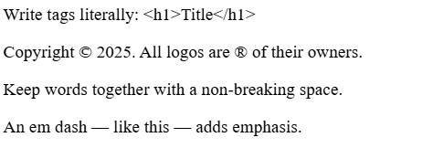
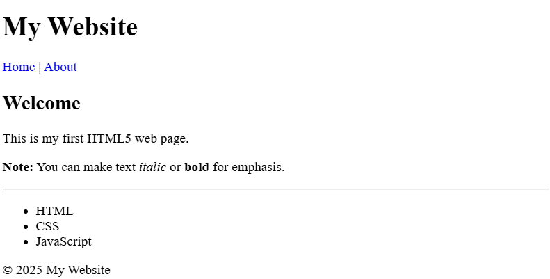

# Module 1 — Introduction to the Web & HTML Basics


## 1.1 History and Architecture of the Internet

The Internet is one of the most transformative technological achievements in human history. It enables global communication, commerce, education, and entertainment, connecting billions of devices and people across the world. Understanding its historical development and architectural design provides the foundation for studying modern web technologies.

### A. Historical Development

#### 1960s – ARPANET and Packet Switching

The origins of the Internet trace back to the **U.S. Department of Defense’s Advanced Research Projects Agency (ARPA)**, which sought to create a resilient communication network for research institutions. The system, known as **ARPANET**, was designed to allow computers in different locations to share information even in the event of network disruptions.

A critical innovation enabling this network was **packet switching**, independently pioneered by **Paul ****Baran** in the United States and **Donald Davies** in the United Kingdom. In packet switching, data is divided into small units, or _packets_, which are transmitted independently and reassembled at the destination. This approach was more efficient and robust than traditional circuit-switched communication.

**Historical Note:** The first ARPANET message was sent in 1969 between the University of California, Los Angeles (UCLA) and Stanford Research Institute. The message “LOGIN” crashed the system after only the first two letters were transmitted.

#### 1970s – TCP/IP Protocol Development

While ARPANET successfully connected multiple sites, it initially relied on protocols that were not well-suited for inter-network communication. This changed with the work of **Vinton Cerf** and **Robert Kahn**, who developed the **Transmission Control Protocol/Internet Protocol (TCP/IP)** suite.

- **TCP** handles reliable transmission, error detection, and packet ordering.

- **IP** manages addressing and routing of packets between devices.

On **January 1, 1983**, often called _“flag day”_, ARPANET officially switched to TCP/IP, marking the beginning of the modern Internet.

#### 1980s – NSFNET and Network Expansion

In the 1980s, the **National Science Foundation (NSF)** created **NSFNET**, which expanded connectivity to academic and research institutions.

- NSFNET replaced ARPANET as the primary Internet backbone.

- Use was initially restricted to non-commercial purposes.

- The architecture allowed multiple regional networks to connect and exchange traffic, further decentralizing control.

#### 1990s – World Wide Web and Commercialization

In 1991, **Tim Berners-Lee**, working at CERN, introduced the **World Wide Web (WWW)**, a system for accessing linked documents via the Internet. This innovation included:

- **HTML** (HyperText Markup Language) for document formatting.

- **HTTP** (HyperText Transfer Protocol) for data exchange.

- The first web browser, which enabled easy navigation between pages.

This decade saw the emergence of **Internet Service Providers (ISPs)**, the creation of the **Domain Name System (DNS)**, and the widespread commercialization of the Internet.

#### 2000s – Broadband and Mobile Internet

The early 2000s were marked by the transition from slow, dial-up connections to high-speed **broadband** Internet. This change supported richer web content, streaming media, and more interactive websites. The introduction of **smartphones** brought the Internet into the mobile domain, making it accessible anytime and anywhere.

#### 2010s–Present – Cloud Computing, IoT, and 5G

The last decade has seen several transformative trends:

- **Cloud Computing** enables storage, computing, and applications to be delivered over the Internet.

- The **Internet of Things (****IoT****)** connects everyday devices such as appliances, vehicles, and wearables.

- **5G Networks** offer unprecedented speed and low latency, supporting real-time applications such as augmented reality (AR), virtual reality (VR), and autonomous systems.

### B. Architecture of the Internet

The Internet is not a single centralized system but rather a **global, decentralized network of networks**. It is designed to be **scalable**, **resilient**, and **interoperable**, enabling billions of devices—from desktop computers to smartphones to embedded sensors—to communicate seamlessly.

At the core of this design is a **layered architecture**, which divides network functionality into logical layers. This modular approach allows different technologies to evolve independently while still working together.

#### 1. The TCP/IP Model

The dominant framework for understanding Internet architecture is the **TCP/IP model**, named after its two foundational protocols: the **Transmission Control Protocol (TCP)** and the **Internet Protocol (IP)**. This model consists of four conceptual layers, each responsible for specific functions.

|Layer|Primary Function|Example Protocols|
|---|---|---|
|Application Layer|Interface between applications and the network; defines how programs exchange data.|HTTP, HTTPS, FTP, SMTP, DNS|
|Transport Layer|Ensures complete, reliable data delivery or fast, connectionless delivery.|TCP, UDP|
|Internet Layer|Handles logical addressing and routing of data packets across networks.|IP (IPv4, IPv6), ICMP|
|Link Layer|Manages physical network connections and data framing.|Ethernet, Wi-Fi, PPP|


**Key Point:**

The TCP/IP model is more practical for Internet engineering than the older OSI model because it was built and refined alongside real-world implementations.

#### 2. Packet Switching

All Internet communication relies on **packet switching**, in which data is divided into smaller units called _packets_ before transmission.

**Process:**

- **Segmentation** – The sending device splits the original data into packets.

- **Routing** – Each packet is sent independently and may take different paths through the network.

- **Reassembly** – The receiving device reconstructs the original data from the packets.

**Advantages:**
- Efficient use of network bandwidth.

- Resilience to node or link failures.

- Supports multiple simultaneous communications.

**Example:** If you stream a video, each second of video is split into packets that may travel via different routes before arriving in order at your device.

#### 3. The Client-Server Model

Most Internet services operate on the **client-server model**:

- **Client:** Requests resources (e.g., a browser requesting a web page).

- **Server:** Provides the requested resources (e.g., a web server sending HTML, CSS, and JavaScript files).

**Example****:** When you visit www.example.com:

1. Your browser (client) sends an HTTP request over the Internet to a server.

1. The server processes the request and sends back a response.

1. The browser renders the response for you to see.

#### 4. DNS and Name Resolution

The **Domain Name System (DNS)** translates human-readable domain names into IP addresses. This enables users to access websites without memorizing numerical addresses.

**Resolution Steps:**

1. The client/browser queries a DNS resolver (often provided by the ISP).

1. The resolver contacts authoritative DNS servers.

1. The IP address is returned to the client.

1. The client connects to the server using that IP.

**Example****:** www.google.com might resolve to 142.250.190.14 (IPv4) or 2607:f8b0:4006:80a::200e (IPv6).

#### 5. IP Addressing

Every device connected to the Internet must have a **unique identifier** so that data can be sent to and received from it. This identifier is known as an **Internet Protocol (IP) address**. IP addresses function much like mailing addresses—they tell the network where to deliver data packets.

There are two main versions of IP in use today: **IPv4** and **IPv6**.

**IPv4 – The Older Version**

- **IPv4** (Internet Protocol version 4) is the **original and older version** of the protocol, standardized in the early 1980s.

- It uses **32-bit addresses**, typically written in dotted-decimal format, such as 192.168.1.1.

- The 32-bit space allows for approximately **4.3 billion unique addresses**. While this seemed more than enough in the early days of the Internet, rapid growth—driven by personal computers, smartphones, and IoT devices—quickly exhausted available IPv4 addresses.

- IPv4 remains in widespread use today, but address shortages have made it increasingly reliant on techniques like **NAT (Network Address Translation)** to share a single public IP among multiple devices.

**IPv6 – The Newer Version**

- **IPv6** (Internet Protocol version 6) was developed to overcome IPv4’s limitations, especially its address shortage.

- It uses **128-bit addresses**, represented in hexadecimal and separated by colons, such as 2001:0db8:85a3:0000:0000:8a2e:0370:7334.

- This design provides **approximately 3.4 × 10³⁸ unique addresses**, enough to assign billions of addresses to every human being on Earth for centuries to come.

- IPv6 also introduces improvements such as simplified packet headers, built-in support for security (IPsec), and more efficient routing.

**Transition from IPv4 to IPv6**

The adoption of IPv6 has been gradual. Many networks and devices now support both versions through a method called **dual-stack operation**, allowing them to communicate over either protocol as needed. IPv4 is expected to remain in use for years, but IPv6 adoption is steadily increasing due to the continued growth of Internet-connected devices.

#### 6. Internet Backbone and Routing

The Internet’s “backbone” is made up of high-speed, long-distance networks operated by major telecommunications companies and government agencies. Routers direct packets through the most efficient paths, using routing protocols like **BGP (Border Gateway Protocol)** to share information about network reachability.

#### How the Web Works: The Request–Response Cycle

When a user accesses a web page, several interconnected systems work together in a rapid sequence to deliver the requested content:

1. **URL Entry** – The user types a web address into the browser.

1. **DNS Lookup** – The browser (or operating system) queries DNS to find the server’s IP address. If cached, this step is skipped.

1. **Connection Establishment** – Using the IP address, the browser opens a network connection to the server (via TCP handshake, or TLS handshake for HTTPS).

1. **HTTP/HTTPS Request** – The browser sends a structured request for the desired resource (page, image, script).

1. **Server Processing** – The server retrieves or generates the requested resource.

1. **HTTP/HTTPS Response** – The server sends back the requested data, along with headers and a status code.

1. **Rendering** – The browser interprets the HTML, loads related CSS/JavaScript, and displays the final page to the user.

Note that:

- **Speed** – All these steps typically happen in under a second.

- **Multiple Requests** – A single web page can trigger dozens or hundreds of separate HTTP requests for images, stylesheets, scripts, and other assets.

- **Parallelism** – Modern browsers open multiple simultaneous connections to speed up loading.

- **Security** – HTTPS ensures the content is encrypted and protected from tampering.

## 1.2 Development Tool: Visual Studio Code

For this course, we will use **Visual Studio Code (VS Code)** as our primary text editor and development environment. VS Code is a **free**, **open-source**, and **cross-platform** editor developed by Microsoft, ideal for modern web development.

### Why VS Code?

- **Lightweight but Powerful** – Starts quickly and runs efficiently, even on modest hardware.

- **Cross-Platform** – Works on Windows, macOS, and Linux.

- **Excellent Web Development Support** – Built-in support for **HTML**, **CSS**, and **JavaScript**.

- **Integrated Tools** – Terminal, debugging, and Git integration.

- **Extensible** – A large marketplace of extensions to enhance functionality.

### Mandatory Extension for HTML and CSS Modules

For the HTML and CSS modules, **installation of the “Live Preview” extension is mandatory**. **Live Preview** allows you to see changes to your HTML and CSS code immediately in a browser-like view within VS Code. This ensures quick feedback during coding exercises.

**Installation Steps for Live Preview:**

1. Open VS Code.

1. Click on the **Extensions** icon (left sidebar) or press Ctrl+Shift+X (Windows) / Cmd+Shift+X (Mac).

1. Search for **Live Preview**.

1. Click **Install**.

1. Once installed, from the Explorer View, right-click the name of any HTML file you want to preview live. Then, from the pop-up menu, select **Show Preview**.

### Extensions for Later Modules

When we reach **JavaScript** and **Node.js** (Modules 6 and beyond), students will install additional extensions such as:

- **JavaScript (ES6) Code Snippets** – For faster JavaScript coding.

- **Node.js Extension Pack** – For Node.js development and debugging.

- **REST Client** – To test API endpoints in later modules.

### Academic Integrity Notice

All **AI-based coding extensions** (such as **GitHub Copilot**, **Tabnine**, or similar tools) **must be disabled** when working on anything related to this course, including assignments, quizzes, labs, and exams.

!!! danger "AI Extentions"
    - **Any AI-assisted code will be considered cheating** and will result in a grade of zero for the entire assignment or exam.

    - This policy applies to all modules in the course.

    - Students may still use extensions for formatting, syntax highlighting, and linting as long as they do not auto-generate code.

### Instructor’s Tip
!!! tip "Mastering a few essential keyboard shortcuts in VS Code will save you time"

    - **Toggle comment** – `Ctrl + /` (Windows) or `Cmd + /` (Mac)

    - **Format document** – `Alt + Shift + F` (Windows) or `Option + Shift + F` (Mac)

    - **Quick file open** – `Ctrl + P` (Windows) or `Cmd + P` (Mac)

## 1.3 Introduction to HTML5: Basic Tags, Structure, Semantic Elements
HTML (**HyperText**** Markup Language**) is the standard language used to create and structure web pages. HTML5 is the latest version, introducing modern features for multimedia, accessibility, and cleaner code. Every web page—whether simple or complex—is built on HTML.

!!! note "Accessibility"
    **Accessibility** is the practice of designing and building digital content so that people with diverse abilities can perceive, operate, and understand it—using tools like screen readers, captions, and keyboard navigation. It follows the **POUR** principles: *Perceivable*, *Operable*, *Understandable*, and *Robust*; meeting these improves usability for everyone and helps satisfy standards and legal requirements.

**Purpose of HTML**

- **Structure** – Organizes content into headings, paragraphs, lists, images, and other elements.

- **Semantics** – Adds meaning to content through descriptive tags (e.g., <header> for a page header).

- **Integration** – Works alongside CSS for styling and JavaScript for interactivity.

- **Reminder:** HTML is _not_ a programming language—it is a markup language that describes content structure.

### Structure of an HTML Element

Most HTML content is made of **elements**, which have three main parts:

```html
    <tagname attribute="value">Content goes here</tagname>
```

- **Opening Tag** – Marks the start of the element and can include attributes. 

- **Element Type** – `tagname` specifies the element type.

- **Content** – The text, image, or other media inside the element. Example: This is a paragraph.

- **Closing Tag** – Marks the end of the element, starting with a forward slash.

**Example:**

```html
    <h1>My Heading</h1>
```
Here:

- `<h1>` is the opening tag.

- `h1` is the element type.

- `My Heading` is the content.

- `</h1>` is the closing tag.

### Void elements

Some HTML elements are **void elements**: they consist of a single opening tag and **cannot contain any content**, so they also **do not use a closing tag**. Some common examples are:

- `<hr>` — inserts a horizontal rule (divider)
- `<br>` — inserts a line break
- ``— inserts an image

These elements may still have attributes (when applicable), but they must **not** wrap content and must **not** have closing tags.

**Example**
```html
    <p>First line<br>Second line</p>
    <hr>
```

!!! note "Self-Closing form"
    In HTML5, the self-closing form `<tagname />` for void elements is allowed, but not required. 

The following code is valid in HTML5:

```html
    <p>First line<br/>Second line</p>
    <hr/>
```
In the above example, we used self-closing form for void elements. So, `<br/>` and `<hr/>` are valid, but we prefer the simplifed version of them, which are `<br>` and `<hr>`.

### Attributes

- **Definition:** Attributes provide extra information about an element.

- **Placement:** Written inside the opening tag as name–value pairs.

- **Default Values:** Many attributes have default values if not explicitly set.

- **Changing Values:** You can override the default by specifying a new value in the attribute.

**Example with Attribute:**

```html
    
```

Here the attributes are:

- `src` is the file path to the image.

- `alt` provides alternative text for accessibility.

- `width` changes the displayed width from its default to 300 pixels. The `` without a width attribute displays at its original size.

### Basic HTML Document Structure**

An HTML5 document follows this standard layout:

```html
<!DOCTYPE html>
<html>
    <head>
        <meta charset="UTF-8">
        <title>My First HTML Page</title>
    </head>

    <body>
        <h1>Hello, World!</h1>
        <p>This is my first web page.</p>
    </body>
</html>
```
**Key parts:**

-`<!DOCTYPE html>` – Declares HTML5.

-`<html>` – Root element containing all HTML code.

-`<head>` – Metadata and configuration of the page (title, character encoding, linked CSS/scripts).

-`<body>` – The visible page content.

### Common Basic Tags

|Tag|Purpose|Example|
|---|---|---|
|`<h1>` to `<h6>`|Headings (largest to smallest)|`<h1>Main Title</h1>`|
|`<p>`|Paragraph|`<p>This is a paragraph.</p>`|
|`<a>`|Link to another page or resource|`<a href="https://example.com">Visit Example</a>`|
|``|Display an image|``|
|`<ul>` / `<ol>`|Unordered / Ordered list|`<ul><li>Item</li></ul>`|
|`<li>`|List item|`<li>Milk</li>`|
|`<div>`|Generic block container|`<div>Section</div>`|
|`<span>`|Generic inline container|`<span>Text</span>`|
|`<b>`|Bold text (stylistic)|`<b>Important</b>`|
|`<i>`|Italic text (stylistic)|`<i>Emphasis</i>`|
|`<hr>`|Horizontal rule (section divider)|`<hr>`|


### Semantic Elements in This Course

We will use **a simplified set** of HTML5 semantic tags in this course:

- `<header>` – Page or section header.

- `<nav>` – Navigation links.

- `<main>` – The main content area of the page.

- `<section>` – Thematically grouped content.

- `<footer>` – Footer information.

### HTML “Special Characters” and Symbols

Some characters are **special** because they’re used by HTML itself (like `<`, `>`, `&`) or they represent symbols not on a typical keyboard. To show them **as text** in a web page, use an **HTML entity**:

- **Syntax:** `&code;` → an ampersand, a named code, and a semicolon  
- You can also use numeric forms: `&#169;` (decimal) or `&#x00A9;` (hex)

#### Common entities

| Write (entity) | Renders as | Meaning |
|---|:---:|---|
| `&lt;`   | <   | less than (escape `<`) |
| `&gt;`   | >   | greater than (escape `>`) |
| `&amp;`  | &   | ampersand (escape `&`) |
| `&nbsp;` | ␣   | non-breaking space |
| `&copy;` | ©   | copyright symbol |
| `&trade;`| ™   | trademark symbol |
| `&reg;`  | ®   | registered symbol |
| `&mdash;`| —   | em dash |

!!! tip "When to use them"
    Use entities whenever you want the literal characters **`<`**, **`>`**, or **`&`** to appear in text (not be interpreted as tags), or when you need a symbol like **©**, **™**, **®**, or a **non-breaking space**.

#### Example

```html
<p>Write tags literally: &lt;h1&gt;Title&lt;/h1&gt;</p>
<p>Copyright &copy; 2025. All logos are &reg; of their owners.</p>
<p>Keep words together with a&nbsp;non-breaking space.</p>
<p>An em dash &mdash; like this — adds emphasis.</p>
```
???+ "Output of the code"
    {width=350}

### More on A elements

The anchor element (`<a>`) creates hyperlinks. It wraps the **clickable text (or image)** and points to a destination via attributes.

```html
<a href="URL-or-path">Link text</a>
```

#### `href` (required)
What the link points to:

- **External page (absolute URL)**  
  ```html
  <a href="https://developer.mozilla.org/">MDN Web Docs</a>
  ```
- **Page/file in your site (relative URL)** — path is relative to the current page  
  ```html
  <a href="about.html">About</a>
  <a href="files/syllabus.pdf">Download syllabus (PDF)</a>
  ```
- **Fragment (jump to a section on a page)** — target element needs an `id`  
  ```html
  <a href="#contact">Jump to Contact</a>
  <!-- somewhere on the page -->
  <h2 id="contact">Contact</h2>
  ```
  Note that in the `href-value` you need to put an `#` before the `target id`.

- **Email / phone / other schemes**  
  ```html
  <a href="mailto:info@example.com">Email us</a>
  <a href="tel:+17065551234">Call</a>
  ```

!!! note "Relative paths quick guide"
    - `./` = current folder
    - `../` = go up one folder.  
    - From `modul-01/index.html` to `assets/imgs/firstcode.png` the path is `../assets/imgs/firstcode.png`.

#### `target` (optional)
Controls **where** to open the link. To open the link in a new tab, it is value must be set to `_blank`.


```html
<a href="https://example.com" target="_blank">Visit Example</a>
```

#### Optional helpers
- **Download the file instead of navigating:**  
  ```html
    <a href="files/syllabus.pdf" download>Download syllabus</a>
  ```
- **Title tooltip (use sparingly):**  
  ```html
  <a href="https://example.com" title="Opens Example site">Example</a>
  ```

### Example Page Using Covered Tags

```html
<!DOCTYPE html>
<html>
<head>
    <meta charset="UTF-8">
    <title>Sample Page</title>
</head>

<body>
    <header>
        <h1>My Website</h1>
        <nav>
            <a href="index.html">Home</a> |
            <a href="about.html">About</a>
        </nav>
    </header>
    <main>
        <section>
            <h2>Welcome</h2>
            <p>This is my first HTML5 web page.</p>
            <p><b>Note:</b> You can make text <i>italic</i> or <b>bold</b> for emphasis.</p>
            <hr>
            <ul>
                <li>HTML</li>
                <li>CSS</li>
                <li>JavaScript</li>
            </ul>
        </section>
        </main>
    <footer>
        <p>&copy; 2025 My Website</p>
    </footer>
</body>

</html>
```
???+ "Output of the code"
    { width=600 }


